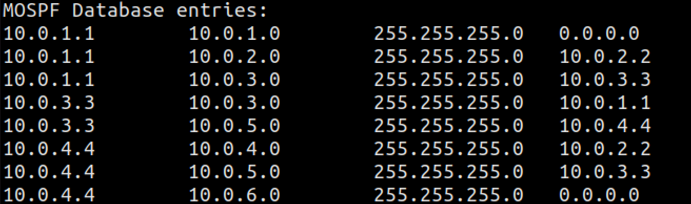

# 网络路由实验报告

热伊莱·图尔贡
2018K8009929030

## 一、实验题目：网络路由实验

## 二、实验过程

1. 构建一致性链路状态数据库：邻居发现
   * void *sending_mospf_hello_thread(void*param)
     每个节点周期性（ hello-interval ：5秒）宣告自己的存在发送
     mOSPF Hello消息，包括节点ID, 端口的子网掩码目的IP地址为224.0.0.5，目的MAC地址为01:00:5E:00:00:05
   * void handle_mospf_hello(iface_info_t *iface, const char*packet, int len)
     节点收到mOSPF Hello消息后
     如果发送该消息的节点不在邻居列表中，添加至邻居列表
     如果已存在，更新其达到时间
   * void *checking_nbr_thread(void*param)
     邻居列表老化操作（Timeout）
     如果列表中的节点在3*hello-interval时间内未更新，则将其删除
2. 链路状态数据库：链路状态的扩散和更新
   * 生成并洪泛链路状态——void *sending_mospf_lsu_thread(void*param)
     当节点邻居列表发生变动时，或超过lsu interval (30秒)未发送过链路状态信息时
     向每个邻居节点发送链路状态信息，包含该节点ID (mOSPF Header)、邻居节点ID、网络和掩码 (mOSPF LSU)。当端口没有相邻路由器（例如r1-eth0, r4-eth2）时，也要表达该网络，邻居节点ID为0。序列号(sequence number)，每次生成链路状态信息时加1。目的IP地址为邻居节点相应端口的IP地址，目的MAC地址为该端口的MAC地址
   * 收到链路状态信息后——void handle_mospf_lsu(iface_info_t *iface, char*packet, int len)
     如果之前未收到该节点的链路状态信息，或者该信息的序列号更大，则更新链路状态数据库
     TTL减1，如果TTL值大于0，则向除该端口以外的端口转发该消息
   * 处理节点失效问题——void *checking_database_thread(void*param)
     当数据库中一个节点的链路状态超过40秒未更新时，表明该节点已失效，将对应条目删除
3. 实现路由器计算路由表项的相关操作
   * 遍历链路状态数据库把链表转化为数组，遍历每个结点的链路信息，构建矩阵。
   * 使用Dijkstra算法计算源节点到其它节点的最短路径和相应前一跳节点，更新路由表。

## 三、实验结果

* 实验内容一：
  * [ ] 基于已有代码框架，实现路由器生成和处理mOSPF Hello/LSU消息的相关操作，构建一致性链路状态数据库
  * [ ] 运行实验
    运行网络拓扑(topo.py)
    在各个路由器节点上执行disable_arp.sh, disable_icmp.sh, disable_ip_forward.sh)，禁止协议栈的相应功能
    运行./mospfd，使得各个节点生成一致的链路状态数据库
    实验结果如下：
    各列数据分别是RID Network Mask Neighbor
    r1节点：

r2节点：

r3节点：

r4节点：

可以看到生成了正确的一致性链路状态数据库。

* 实验内容二：
  * [ ] 基于实验一，实现路由器计算路由表项的相关操作
  * [ ] 运行实验
    运行网络拓扑(topo.py)
    在各个路由器节点上执行disable_arp.sh, disable_icmp.sh, disable_ip_forward.sh)，禁止协议栈的相应功能
    运行./mospfd，使得各个节点生成一致的链路状态数据库
    等待一段时间后，每个节点生成完整的路由表项
    在节点h1上ping/traceroute节点h2
    关掉某节点或链路，等一段时间后，再次用h1去traceroute节点h2
    实验结果如下：
    在节点h1上ping/traceroute节点h2

在mininet中执行 link r2 r4 down：

在mininet中执行 link r3 r4 down：

路径输出正常。

## 四、思考题

1. 在构建一致性链路状态数据库中，为什么邻居发现使用组播(Multicast)机制，链路状态扩散用单播(Unicast)机制？

邻居发现是为了节点周期性的发现是否有新的邻居，通过没有特定目的地址的广播能够发现自己的新邻
居，并加入邻居列表。若使用单播则必须知道目的地址，无法分现新加入的邻居，因此使用组播机制。链路状态的扩散周期性地向精准的目的地址的邻居发送链路信息。组播与单播相比没有纠错机制，发生丢包错包后难以弥补，因此使用单播机制。

2. 该实验的路由收敛时间大约为20-30秒，网络规模增大时收敛时间会进一步增加，如何改进路由算法的可扩展性？

当网络规模较大时，可以利用洪泛法交换减少了整个网络上的通信量。从而可以减小信息交换的规模，减小收敛时间，使得系统的可扩展性进一步增强。

3. 路由查找的时间尺度为ns，路由更新的时间尺度为~10s，如何设计路由查找更新数据结构，使得更新对查找的影响尽可能小？

可以在计算最短路时，从更新链路信息的节点开始，只更新有受到影响的节点的路由信息，只对这些节点更新路由表。
